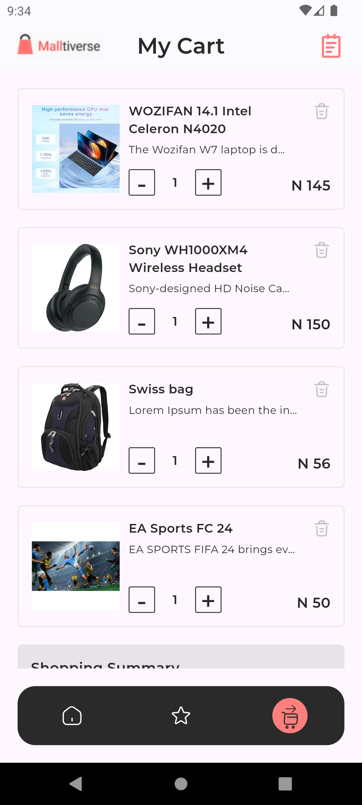

# Malltiverse HNG Task 3

This Flutter application is designed to integrate with the Timbu API to retrieve and display product information. The app adheres to the MVVM architecture pattern and showcases a list of products with their images and relevant details.

## Features

- Fetches product data from the Timbu API.
- Displays a list of products with images, names, descriptions, and available quantities.
- Have at least 20 Unique Products in your product list. They should be categorized.
- Implement the feature of adding and removing products, wishlist or bookmark, checkout of order e.t.c based on your timbu shop design.
- Good shopping experience from start to the completion of an order.
- Create an Orders history screen i.e showing all the completed orders made on your timbu shop. Add an icon on your home screen top bar that navigates to the order history screen. Come up with the design if not available.
- The Orders history item when clicked must go to a details screen of that order and show details of that order.
- The items in the order history screen and details should be cached in a database.
- Implements proper mobile architecture with state management.
- Ensures a user-friendly and intuitive UI.

## Screenshots

### Splash Screen

### Products Screen

### Product Details Screen

### Order History Screen

## Setup Instructions

### Prerequisites

- Flutter SDK: [Installation Guide](https://flutter.dev/docs/get-started/install)
- Timbu API account: [Sign up here](https://timbu.cloud)

### Project Setup

1. **Clone the repository**

   git clone <https://github.com/fidelity2851/malltiverse_hng.git>

   cd malltiverse_hng

   flutter pub get

   flutter run

### Demo

A virtualized demonstration of the app is available on [Appetize.io](https://appetize.io/app/b_mhxogqkgxhfsgv3xuiwe3uwbwa)

### License

Distributed under the MIT License.
